# Tan's Playroom (frontend)

Aplicación web desarrollada con **Angular** que sirve de interfaz para gestionar una ludoteca ficticia: autores,
categorías, clientes, catálogo de juegos y préstamos. El nombre viene del mismo contexto del tutorial — una ludoteca
imaginaria llamada Tan's Playroom (en la UI en español aparece como *Ludoteca Tan*).

Este repositorio es el **cliente**: habla con una API REST en **Spring Boot** que vive en otro proyecto. Lo planteé
con fines puramente educativos, para afianzar Angular (componentes, rutas, servicios HTTP, formularios) y encajar el
frontend con un backend real ya existente.

---

## Stack tecnológico

| Área | Tecnología |
|------|------------|
| Lenguaje | TypeScript (~5.5) |
| Framework | Angular 18 |
| UI | Angular Material 18 + CDK |
| Estilos | SCSS, tema predefinido *azure-blue* |
| HTTP / estado asíncrono | HttpClient, RxJS 7 |
| i18n | ngx-translate (carga de JSON desde `public/i18n/`) |
| SSR | Angular SSR (`@angular/ssr`), Express en `server.ts` |
| Build | Angular CLI, aplicación `application` (Vite bajo el capó en dev) |

---

## Arquitectura (frontend)

La app está organizada de forma clásica en Angular:

1. **Módulos por dominio** — `category`, `author`, `game`, `client`, `loan`, más un `core` con cabecera y diálogos
   reutilizables. Cada feature encapsula sus pantallas y declara lo que necesita.
2. **Routing** — `AppRoutingModule` carga los listados y formularios; la navegación principal va en la barra superior.
3. **Servicios** — Llamadas REST al backend (`http://localhost:8080/...`) con `HttpClient`; los componentes se suscriben
   y muestran tablas, filtros o diálogos según la respuesta.
4. **Presentación** — Tablas Material, formularios reactivos o con `ngModel` donde encaja, y diálogos (`MatDialog`)
   para altas, ediciones y confirmaciones.

No es microfrontends ni Nx: es un monolito front razonable para un curso, fácil de seguir carpeta por carpeta.

---

## Requisitos previos

- **Node.js** 20 o superior (recomendado alinear con lo que uses en el curso).
- **npm** (viene con Node). No hace falta instalar Angular CLI de forma global si usas `npx ng ...`.
- El **backend Spring Boot** levantado si quieres ver datos reales (por defecto en el puerto **8080**).

---

## Cómo ejecutar la aplicación

En la raíz del proyecto (donde está el `package.json`):

```powershell
npm install
npx ng serve
```

Abre el navegador en `http://localhost:4200/`. El front espera la API en `http://localhost:8080`; si no hay servidor,
verás errores de red en las pantallas que consultan datos.

**Build de producción:**

```powershell
npx ng build
```

Salida en `dist/tutorial/`.

**Servidor SSR (si lo necesitas probar):** tras un build, el script del `package.json` arranca Node con el bundle del
servidor. En el día a día del tutorial suele bastar con `ng serve`.

---

## Internacionalización

Los textos están en `public/i18n/es.json` y `en.json`. El idioma se puede cambiar en la cabecera y se guarda en
`localStorage` para la próxima visita.

---

## Capturas

### Página principal
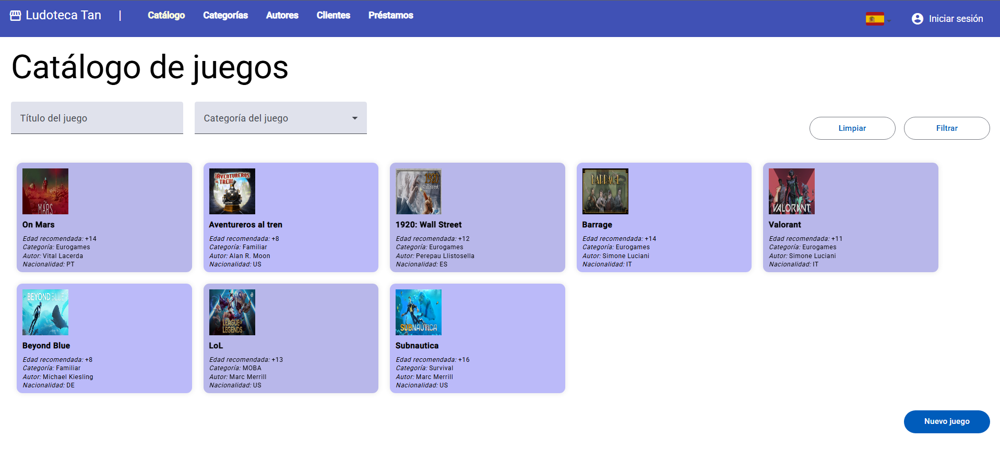

### Autores
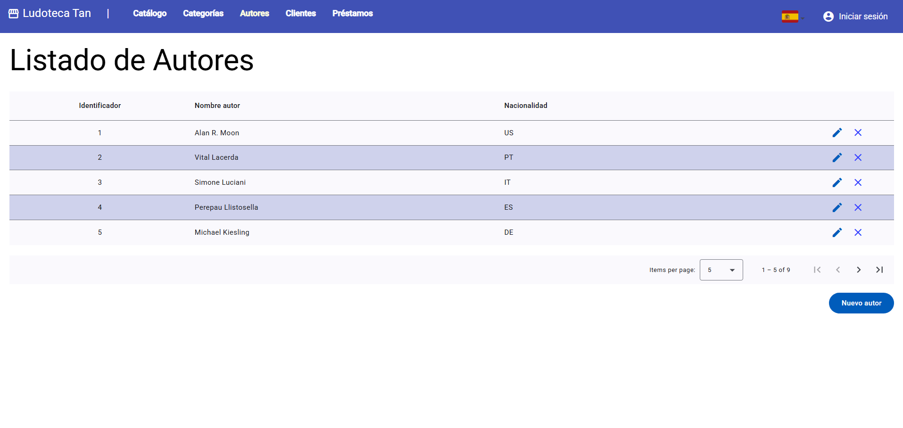

### Categorias
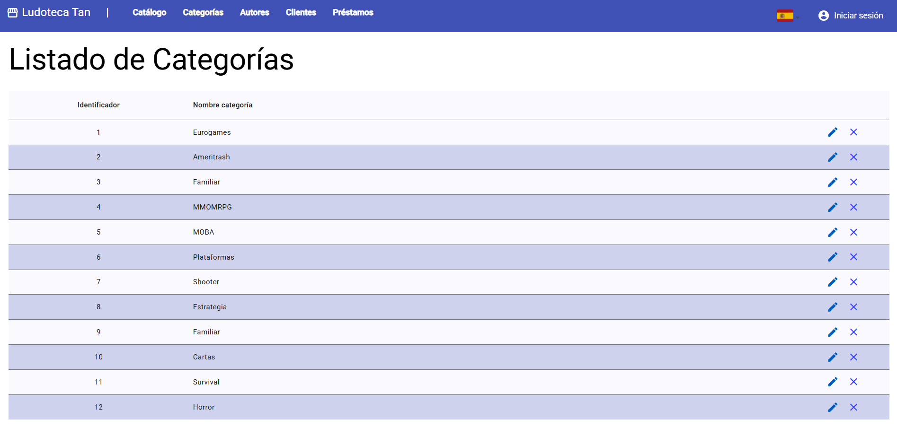

### Clientes
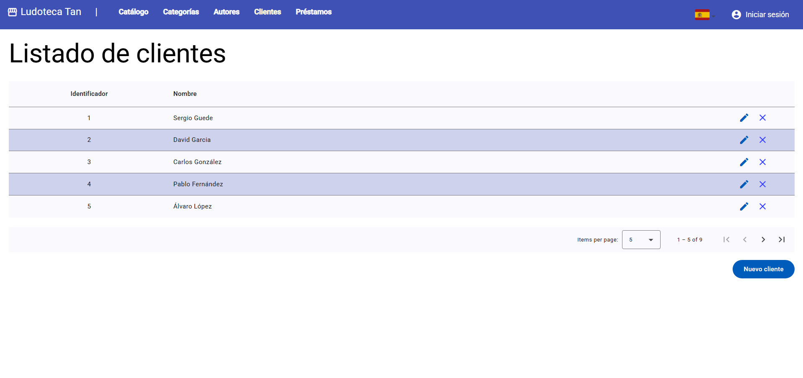

### Prestamos
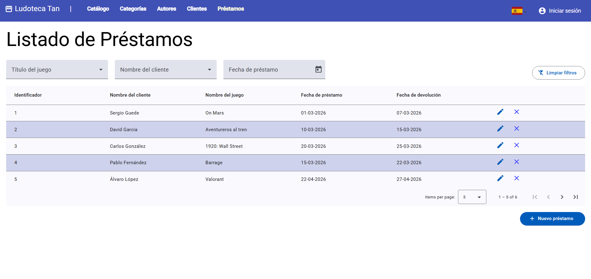

### Crear Entidad
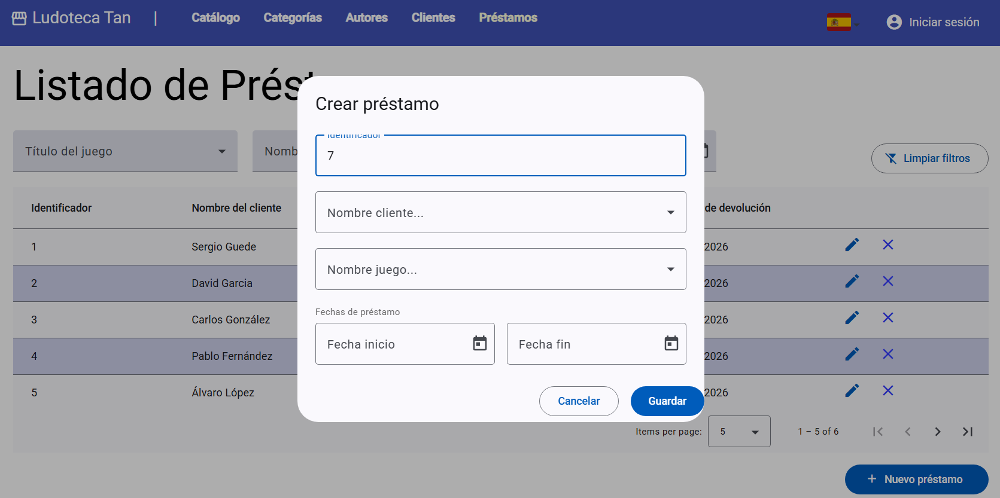

### Editar Entidad
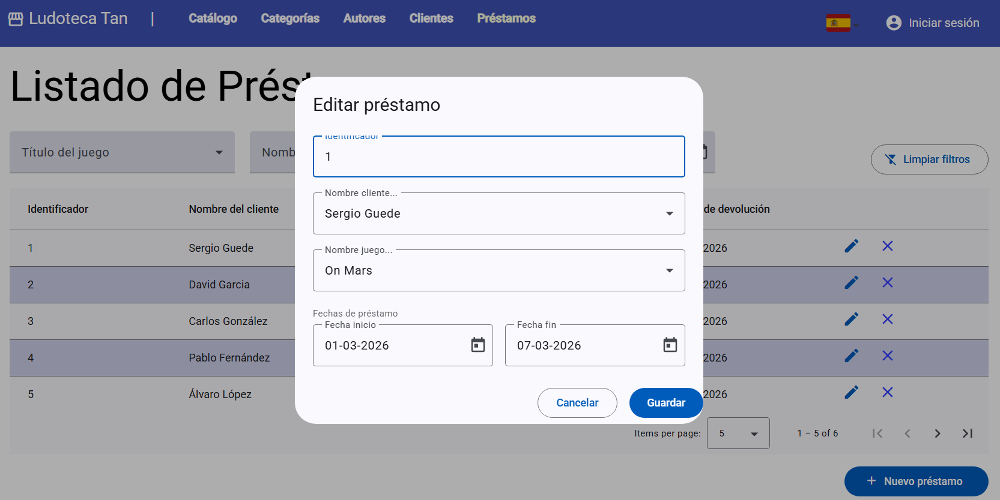

### Borrar Entidad
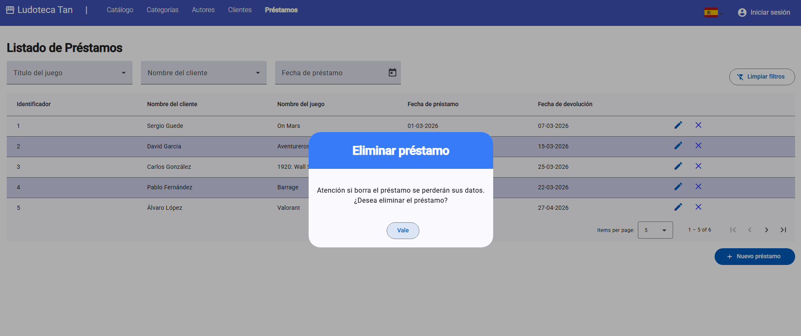

### Filtros (1)
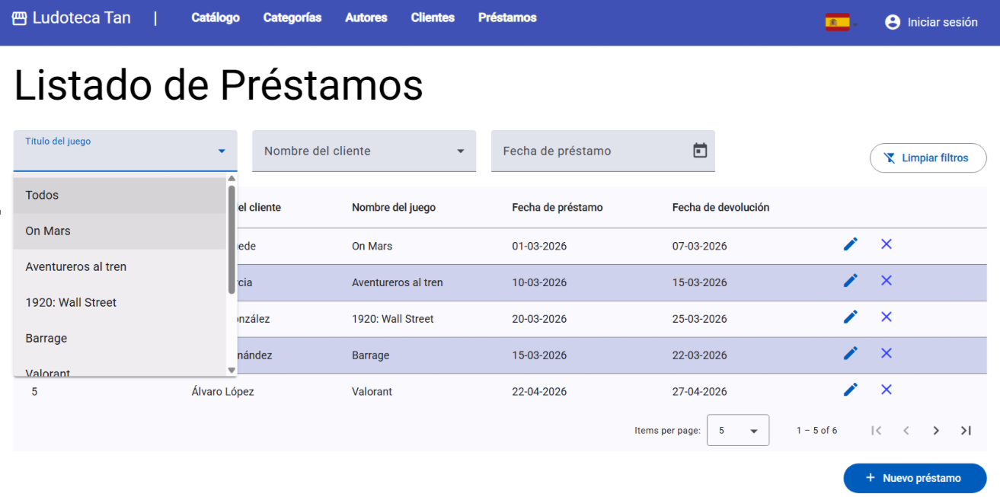

### Filtros (2)
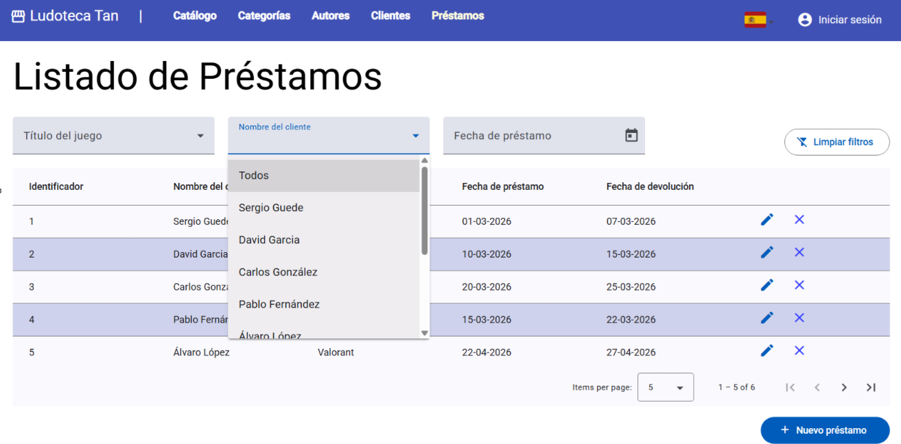

### Selección de lenguaje
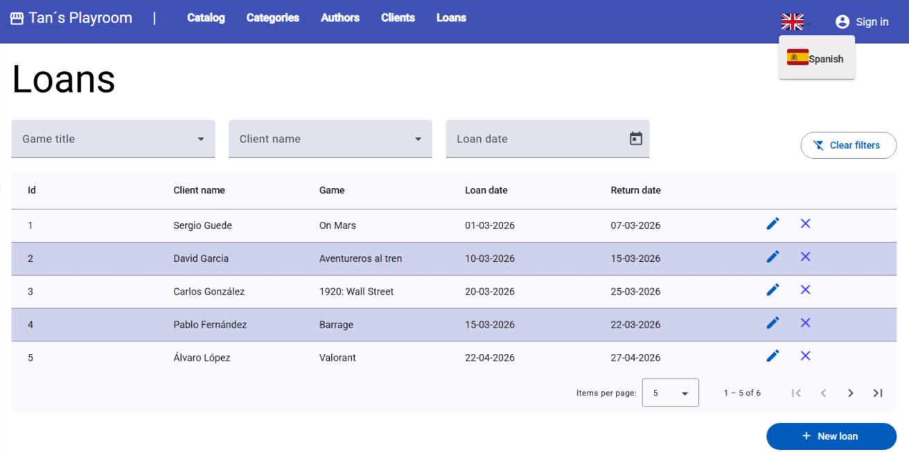

### Control de errores
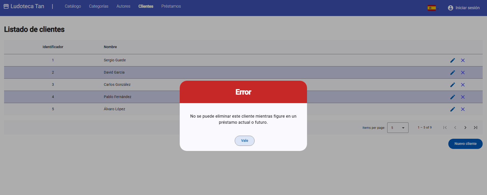
---

## Pruebas unitarias

```powershell
npx ng test
```

Usa Karma + Jasmine. No es una suite enorme; está pensada sobre todo para componentes y servicios clave.

---

## Estructura del repositorio (resumen)

```
Tutorial/                    # Este repo (frontend Angular)
├── public/
│   └── i18n/                # Traducciones ES / EN
├── src/
│   ├── app/
│   │   ├── core/            # Cabecera, diálogos compartidos
│   │   ├── category/ | author/ | game/ | client/ | loan/
│   │   ├── app.module.ts
│   │   └── app-routing.module.ts
│   ├── styles.scss
│   └── index.html
├── angular.json
├── package.json
├── server.ts                # Entrada SSR + Express
└── docs/                    # Capturas
```

El backend Spring Boot suele vivir en otro directorio o repositorio del mismo curso (módulo Maven con `mvnw`).

---

## Qué practiqué aquí

- Montar una SPA con **Angular** (módulos, rutas, servicios inyectables).
- Consumir una **API REST** con `HttpClient` y manejar errores (por ejemplo restricciones al borrar con préstamos
  relacionados).
- Construir interfaz con **Angular Material** (tablas, formularios, diálogos, paginación).
- Añadir **i18n** en runtime con ngx-translate y archivos JSON.
- Tocar **SSR/prerender** de Angular sin convertirlo en el objetivo principal del ejercicio.

---

Si algo no arranca, lo primero es comprobar que el backend responde en el puerto esperado y que no hay otro proceso
ocupando el 4200 o el 8080.
